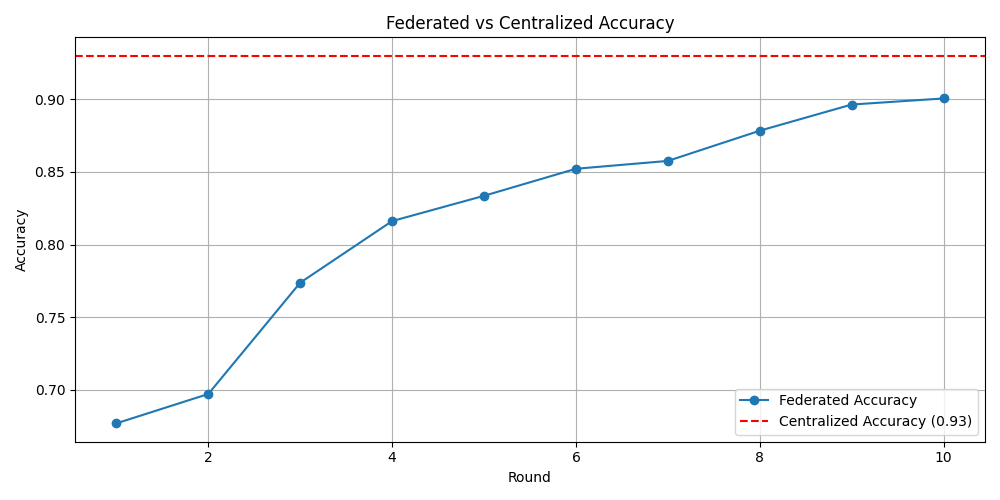
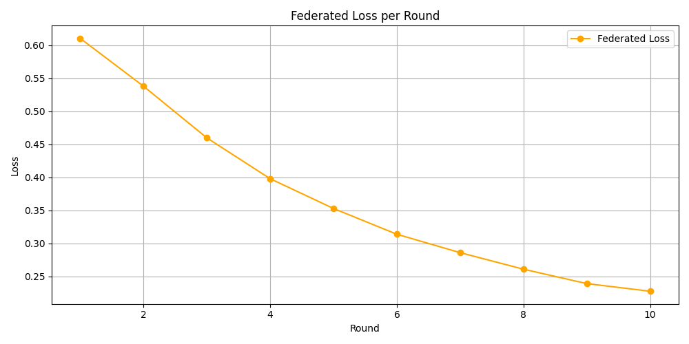

# 🔐 Encrypted-AI: Privacy-Preserving Federated Learning

This project simulates a real-world federated learning setup for detecting suspicious user behavior using synthetic regional login/session data — all while preserving data privacy by avoiding centralized data collection.


## 🚀 Project Overview

- **Goal:** Detect abnormal login behavior without sharing raw data.
- **Approach:** Use federated learning (with Flower) to train a shared model across distributed synthetic clients (regions).
- **Tech:** Python, TensorFlow, Flower, Pandas, Matplotlib.


## 🧠 Features

-  Federated learning simulation with 5 clients (Region_A to Region_E)
-  Centralized vs. federated accuracy comparison
-  Privacy-preserving: No raw data leaves clients
-  Visualization of accuracy/loss per training round
-  Full automation to launch server + all clients
-  Interactive Streamlit dashboard to explore training metrics


## 🧪 Architecture

```plaintext
               +----------------------+
               |      Server (FL)     |
               +----------+-----------+
                          |
         +----------------+----------------+------------------+----------------+
         |                |                |                  |                |
    Region_A         Region_B         Region_C         Region_D         Region_E
    client.py        client.py        client.py        client.py        client.py
```


## 📈 Visualizations

This section showcases how the federated model performed during training, compared to a centralized baseline. The visualizations confirm both convergence and high utility — while ensuring that **no raw user data was shared** between regions.


### ✅ Federated vs Centralized Accuracy



**Interpretation:**

- The federated model's accuracy improves steadily with each round.
- Although it starts lower than the centralized model, it **quickly catches up**, reaching over **90% accuracy** by the final round.
- This demonstrates that **federated learning can achieve near-centralized performance** while preserving data privacy.


### ✅ Federated Loss Drop-off



**Interpretation:**

- The training loss decreases consistently across rounds, showing clear **model convergence**.
- The loss drop-off curve confirms that **local model updates across clients were effectively aggregated** by the server.
- This plot indicates that clients learned meaningful features from their local data, even without seeing others’ data.


### 🎯 Final Outcome

- **High accuracy** (~90%) achieved across distributed clients.
- **No raw data** was shared with the server.
- Federated learning proved to be a **robust and privacy-conscious alternative** to centralized training.

These insights confirm the project’s core goal: **building secure AI systems that respect data boundaries** while still delivering strong performance.

